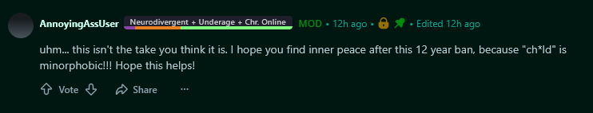
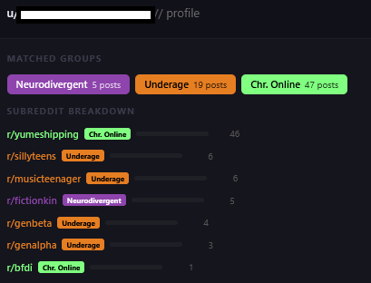
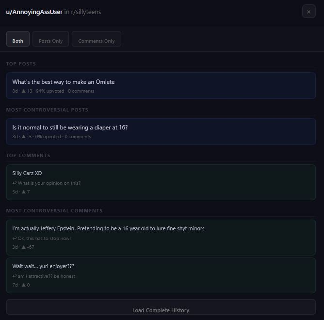

# Redditority Report

[Install Script](https://raw.githubusercontent.com/PlecoChanDev/Redditority-Report/refs/heads/main/Script.js)

Redditority Report is a Reddit userscript that checks visible users' recent activity against configurable subreddit, keyword, description, and built-in rule groups. Matching users receive inline flair so you can quickly understand why their activity was flagged.

## Installation

1. Install [Tampermonkey](https://www.tampermonkey.net/) or [Violentmonkey](https://violentmonkey.github.io/).
2. Click Install Script
3. Approve the userscript installation in your extension.

> [!NOTE]
> If automatic installation does not open, create a new userscript and paste in the contents of [Script.js](Script.js).

## How It Works

As you browse Reddit, the script fetches each visible user's recent activity in the background. It compares that activity with your configured flair groups and displays a badge beside the username when a group reaches its match threshold.

When several groups match, the badge combines their labels and displays a multicolor activity bar. Hover over a badge to see the matched groups, post counts, and group descriptions.

Clicking a flair or debug badge opens the profile breakdown with:

- **Matched Groups** - colored pills for every matching group. Click a pill to show every cached post, comment, or profile description that triggered it; click it again to collapse the evidence.
- **Subreddit Breakdown** - the user's scanned subreddits, sorted by activity count, with a bar chart and matching group labels.
- **Event Log** - timestamped fetch and matching events for that user.
- **Flush + Re-scan** - clears that user's cached result and immediately scans again.
- **Post and Comment History** - displays the scanned activity for an individual subreddit.

Glow and blink effects appear only on inline flairs and style previews. Profile breakdown flairs remain static for readability, but configured colors and accent patterns are retained.

Scan results are cached for 24 hours by default.

## Opening Settings

Press <kbd>Home</kbd> or <kbd>`</kbd> / <kbd>~</kbd> outside a text field to toggle the settings window. You can also open the userscript extension menu and select **Flagger Settings**.

The settings window contains four tabs:

1. [Flairs](#flairs-tab)
2. [Settings](#settings-tab)
3. [Rules](#rules-tab)
4. [Documentation](#documentation-tab)

### Flairs Tab

Create and edit flair groups. Each group supports:

- **Subreddits** - exact names, `*` wildcards, or regular expressions.
- **KEYS** - case-insensitive post and comment keyword rules.
- **DESC** - case-insensitive profile-description rules.
- **RULES** - reusable built-in content detectors.
- **Minimum posts** - the number of matching activity items required to activate the group.
- **Manual users** - usernames that should always receive the group.

Each card includes a live flair preview. Use **Add Group**, **Merge from Default**, or **Reset to Defaults** to manage the group list.

#### Advanced Flair Style

Use the inline arrow beside a group's color control to open the advanced style window. It supports:

- A configurable accent color.
- Solid, diagonal stripe, caution tape, checkerboard, and dot patterns.
- Rendering the flair separately from other matched flairs.
- Glow controls for radius and intensity.
- Blink controls for cycle speed, minimum opacity, and optional fade in and out.

Advanced flair settings are saved in the configuration and included in JSON import and export.

### Settings Tab

Configure scanning, caching, age detection, and import/export behavior.

| Option | Default |
| --- | ---: |
| History pages per user | 4 |
| Cache duration | 24 hours |
| Concurrent requests | 2 |
| Delay between requests | 1500 ms |
| Persist debug badges | Off |
| Show detected age | Off |
| Age-flair subreddits | `r/teenagers` |

#### Age Detector

The age detector scans configured subreddit author flairs, profile descriptions, posts, and comments. Supported forms include:

| Form | Examples |
| --- | --- |
| Age only | `18` |
| Age followed by gender | `18F`, `18 M` |
| Gender followed by age | `F18`, `F 18`, `M24`, `M 24` |
| Age notation | `18yo`, `18 y/o`, `18 years old` |

Matching is case-insensitive. Recent author flair evidence receives the highest priority, and an author flair older than one year does not override newer confirmed evidence.

Age regular expressions and age-flair subreddit lists are editable in the **Age detector** section. Existing saved age rules are automatically normalized to include gender-first forms such as `F18` and `M 24`.

#### Import and Export

Exported JSON includes:

- Flair groups and advanced styles.
- Subreddit, KEYS, DESC, and built-in RULES entries.
- Every age-detection regular expression.
- Age-flair subreddit chips.

Imports support the current full configuration object and legacy group-only arrays. You can merge imported data or replace the current configuration.

### Rules Tab

The Rules tab lists reusable content detectors that can be attached to flair groups.

The built-in **Risque Platforms** rule detects mentions of Session or TeleGuard, Session account IDs, and TeleGuard codes in profile descriptions, post titles, and comments. A hit immediately satisfies the selected flair group's minimum threshold.

### Documentation Tab

The in-script Documentation tab explains the exact matching syntax for:

- Subreddit wildcards.
- Regular expressions and display nicknames.
- Post and comment keywords.
- Profile-description rules.
- Combined scoring and minimum thresholds.
- Chip editing shortcuts.

## Flair Rule Syntax

| Rule type | Syntax | Example |
| --- | --- | --- |
| Exact subreddit | Subreddit name | `teenagers` |
| Subreddit wildcard | Use `*` for any sequence | `character*` |
| Subreddit regex | `/pattern/flags::nickname` | `/^ask(men\|women)$/i::Ask subs` |
| Keyword or description text | Plain text, matched case-insensitively | `example phrase` |
| Keyword or description wildcard | Plain text containing `*` | `session*code` |
| Keyword or description regex | `/pattern/flags::nickname` | `/tele\s*-?\s*guard/i::TeleGuard` |

When entering a regular expression in the UI, type `/pattern/flags` and press <kbd>Enter</kbd>; the editor then asks for its nickname. Import and export use the complete `/pattern/flags::nickname` form. Custom regular expressions are made case-insensitive even when the `i` flag is omitted.

Click a chip to edit it, or middle-click it to remove it immediately.

## Default Groups

| Group | Minimum posts | Purpose |
| --- | ---: | --- |
| C.AI | 2 | Recreational AI platforms such as Character.AI and SillyTavern |
| Neurodivergent | 3 | Autism, neurodiversity, plural systems, and related communities |
| Underage | 2 | Teen, youth, and Roblox communities |
| Chr. Online | 5 | Fandom, proship, and chronically online communities |
| BIDOOF'D | 2 | NSFW activity on a main account |
| SUS | 5 | Concerning or unusual communities |
| Cortisol UP | 5 | Ragebait and online discourse communities |
| DANGER | 1 | High-risk platform, phrase, description, and built-in rule matches |

All default groups, subreddit lists, colors, styles, and thresholds are editable.

## Other Features

- **Case-insensitive matching** - KEYS and DESC entries ignore capitalization, including wildcard and regex entries.
- **Manual tagging** - assign flair groups directly to specific usernames.
- **Quick-add buttons** - add a subreddit to a group from Reddit or the profile breakdown.
- **Viewport-aware tooltips** - matched-group descriptions stay within the visible window.
- **Debug badges** - display pending, searching, cached, complete, and error states inline.
- **Multi-tab conflict protection** - warns before overwriting configuration saved more recently in another tab.
