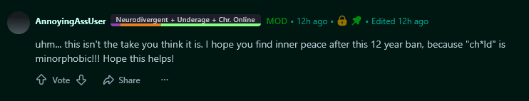
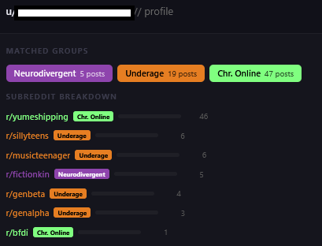
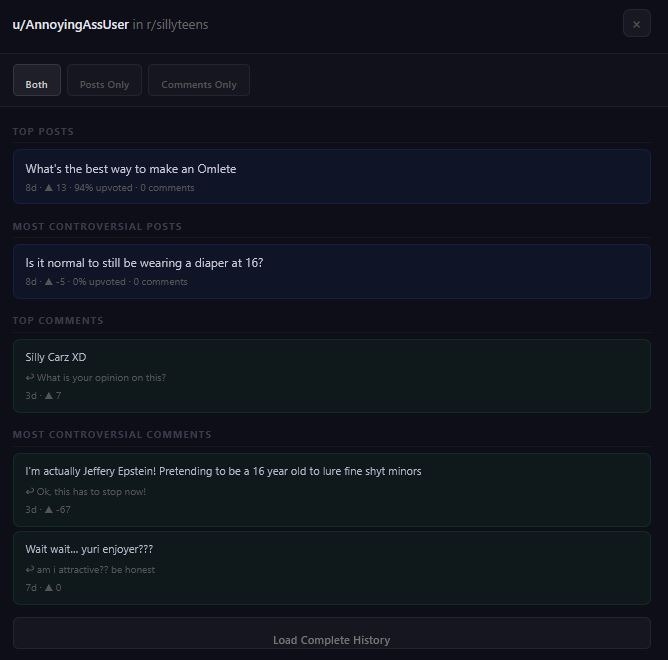

  

# Redditority Report

Redditority Report is a configurable Reddit userscript that scans the recent activity of visible users and adds inline flairs beside their usernames. A flair can be triggered by subreddit activity, words or phrases in posts and comments, profile-description text, built-in detectors, or a manual user assignment.

It works on `www.reddit.com`, `new.reddit.com`, and `old.reddit.com`.

## Install

1. Install a userscript manager such as [Tampermonkey](https://www.tampermonkey.net/) or [Violentmonkey](https://violentmonkey.github.io/).
2. Click **[Install Redditority Report](https://raw.githubusercontent.com/PlecoChanDev/Redditority-Report/refs/heads/main/Script.js)**.
3. Approve the installation in your userscript manager.

If the install page does not open automatically, create a new userscript and paste in [Script.js](Script.js). The script declares both `GM_xmlhttpRequest` and `GM.xmlHttpRequest`, so it supports managers that provide either the legacy or modern request API.

The script's `@downloadURL` and `@updateURL` point to the same GitHub copy, allowing supported userscript managers to install updates.

## Quick start

- Browse Reddit normally. Visible usernames are queued and scanned in the background.
- Press <kbd>Home</kbd>, <kbd>`</kbd>, or <kbd>~</kbd> outside a text field to toggle settings. You can also choose **Flagger Settings** from the userscript manager menu.
- Hover over an inline flair to see its matched groups, descriptions, and counts.
- Click a flair or status badge to open that user's full breakdown.
- Enable **Show + buttons** to add the current subreddit to a flair group while browsing. Left-click `+` to choose a group; right-click it to reuse the last group selected from a `+` menu.

Scans update live after each history page. Provisional flairs show a spinner until all requested history and profile data has finished loading.

## What a profile breakdown shows

Clicking an inline flair opens a panel whose sections can be reordered, expanded, or collapsed:

- **Matched Groups** shows every qualifying flair. Click a group to expand the posts, comments, or profile text that matched it. Matching KEYS, DESC, and text-based RULES are highlighted.
- **Tracked Sightings** shows permanently saved posts and comments collected by the Track Sightings action.
- **Subreddit Breakdown** charts scanned activity by subreddit and identifies the groups that matched it.
- **Age Evidence** explains the source and confidence of a detected age.
- **Keyword Hits** expands the posts and comments for each matched keyword or phrase.
- **Profile Bio** displays the cached profile description and its highlighted matches.
- **Event Log** records fetch, retry, cache, and match events for that user.

Evidence rows link directly to the original Reddit post or comment. The panel also provides **Flush + Re-scan** and per-subreddit post/comment history. Live scan updates patch the open panel without closing it or resetting its scroll position.

## Flair groups and matching

Each flair group has a label, description, colors, minimum score, and one or more matching inputs:

| Field | What it matches | Effect |
| --- | --- | --- |
| **SUBS** | Exact, wildcard, or regular-expression subreddit names | Matching activity contributes to the group's score. |
| **KEYS** | Post titles and comment bodies | Each matching activity item contributes at most one KEY point to that group. |
| **DESC** | The user's profile description | One match immediately satisfies the group's minimum. |
| **RULES** | Reusable built-in detectors and actions | A detector immediately satisfies the minimum; an action runs only after another condition qualifies the group. |
| **MIN** | Required combined score | The flair appears when SUBS and KEYS activity reaches this value. |
| **Manual users** | Explicit username assignments | The assigned flair always appears for that username. |

SUBS and KEYS points are combined. Avoid overlapping exact, wildcard, and regex SUBS entries in the same group when exact counts matter: one subreddit can match more than one entry in that group.

### Matching syntax

Exact subreddit names, wildcards, and plain text matching ignore case. Plain KEYS and DESC entries use whole-word or whole-phrase boundaries; use a wildcard or regular expression when partial-word matching is intentional.

| Rule type | Syntax | Example |
| --- | --- | --- |
| Exact subreddit | Name with or without `r/` | `teenagers` |
| Subreddit wildcard | `*` matches zero or more characters | `teen*` |
| Subreddit regex | `/pattern/flags::nickname` | `/^ask(men|women)$/i::Ask subs` |
| Plain text | Whole word or phrase | `example phrase` |
| Text wildcard | Plain text containing `*` | `session*code` |
| Text regex | `/pattern/flags::nickname` | `/tele\s*-?\s*guard/i::TeleGuard` |

When entering a regex in the UI, type `/pattern/flags` and press <kbd>Enter</kbd>. The editor asks for a nickname and stores the complete `/pattern/flags::nickname` form. Supported JavaScript flags are `g`, `i`, `m`, `s`, `u`, and `y`. KEYS and DESC regexes are made case-insensitive when `i` is omitted. A SUBS regex defaults to `i` when no flags are supplied; otherwise it uses the flags exactly as entered.

Chip shortcuts:

- Press <kbd>Enter</kbd> or comma to add the current value.
- Click a chip to move it back into its input for editing.
- Use its `×` control or middle-click to remove it.
- Press <kbd>Backspace</kbd> in an empty chip input to remove the last chip.

## Built-in rules

The Rules tab lists the detectors and actions that can be attached to a group.

| Rule | Type | Behavior |
| --- | --- | --- |
| **Risque Platforms** | Detector | Finds Session and TeleGuard mentions or supported contact IDs in profile descriptions, post titles, and comments. Matches inside URLs are ignored. |
| **Hidden Profile Activity** | Detector | Matches a successfully completed activity scan that returns no posts or comments. Failed or incomplete scans do not match. |
| **Banned Account (HTTP 403)** | Detector | Matches when the initial profile or history request is denied with HTTP 403. A 403 after pagination begins is treated as an incomplete scan instead. |
| **Track Sightings** | Action | Permanently saves visible posts and comments after another condition or manual assignment has matched the group. |

A detector hit satisfies the selected group's MIN threshold. Track Sightings is intentionally different: it cannot qualify a group by itself.

## Sightings and hidden profiles

Sightings preserve activity that is visible while browsing, even if Reddit later hides or withholds the account's overview.

To use them:

1. Add **Track Sightings** to a group that can match through SUBS, KEYS, DESC, another detector, or a manual assignment.
2. Open **Settings → Sightings** and enable **Do Tracking**. It is off by default.
3. Optionally enable **Whitelist only** and add the usernames that may be tracked.

The tracker deduplicates items by permalink and stores their subreddit, excerpt, timestamp, direct link, and the best available profile image. Once a tracked account has been identified as hidden, the script stops requesting inaccessible history and rebuilds current subreddit, keyword, and applicable text-rule flairs from the saved archive instead.

**Show All Sightings** can search usernames, subreddits, and flair names. It also provides several sort modes and a persistent custom order. Tracked users can be dragged, pinned, locked, previewed, selected, or cleared. Pinned users stay at the top; locked users cannot be removed until unlocked.

Sightings are stored separately from ordinary scan results. Cache expiry and **Flush Cache** do not delete them. Remove sightings from the Sightings manager or use **Clear All Unlocked** when you explicitly want to erase them.

## Age detection

Age detection is enabled by default and checks:

- author flairs from the configured age-flair subreddits;
- profile descriptions;
- post titles; and
- comment bodies.

Supported forms include `18`, `18F`, `18 M`, `F18`, `M 24`, `18yo`, `18 y/o`, and `18 years old`. The default detector accepts ages from 10 through 99 and treats 17 or younger as underage in its test output.

The displayed marker communicates confidence:

| Display | Meaning |
| --- | --- |
| `(18)` | Confirmed or high-confidence evidence |
| `(18?)` | Uncertain history evidence; hidden by default |
| `(20~)` | Current-age estimate advanced from dated, confirmed evidence |

Recent author-flair evidence has the highest priority. Confirmed evidence more than one completed year old can be advanced by elapsed years. Three distinct uncertain items agreeing on the same age are treated as confident; duplicate copies of one item count only once.

**Filter Contextual** is enabled by default. It rejects common false positives involving other people, newborns, pets, vehicles, technology, accounts, products, percentages, ratios, time notation, hypothetical ages, and similar non-author subjects while preserving explicit self-identification. The basic unambiguous rejection rules remain active even if contextual filtering is disabled.

Use **Settings → Age detection** to:

- show or hide detected and uncertain ages;
- edit the age-flair subreddit list;
- edit the detector's regex configuration;
- test text as a post/comment, profile bio, or author flair; or
- restore the bundled detector with **Reset Age Defaults**.

## Appearance and layout

Every flair group has a live preview and configurable base/text colors. The advanced style editor adds:

- a second accent color;
- solid, diagonal, caution, checkerboard, or dot patterns;
- an option to render the group as a separate pill;
- glow radius and intensity;
- blink speed, minimum opacity, and fade behavior; and
- an option to hide the group from the quick-add menu.

Glow and blink run only on inline badges and previews. Breakdown flairs remain static for readability while retaining their colors and patterns.

The interface includes twelve presets: Midnight, Graphite, Ocean, Aubergine, Forest, Ember, Nord, Dracula, High Contrast, Daylight, Paper, and Arctic. A custom theme can change all shared colors and choose light or dark native controls. The readability checker measures text, accent, and state colors against both panel surfaces and prevents an insufficient-contrast custom theme from being saved.

Under **Settings → General → Preferences**, drag the seven breakdown sections into any order and choose which ones start collapsed. A section's current expanded state is preserved while a live scan refreshes the open panel.

## Settings reference

The settings window has four main tabs:

- **Flairs** manages groups, matching inputs, advanced styles, defaults, and manual user tags.
- **Settings** contains the General, Scanning, Age detection, Data, and Sightings pages.
- **Rules** describes the available built-in detectors and actions.
- **Documentation** provides an in-script syntax and editing reference.

Current defaults in v3.27.3:

| Option | Default |
| --- | ---: |
| History pages | `0` (continue until Reddit has no next page) |
| Cache duration | 24 hours |
| Concurrent user scans | 50 |
| Request delay | 0 ms |
| Max retries | 3 (`0` means unlimited) |
| Retry delay | 500 ms |
| Show pending results | On |
| Persist debug flairs | Off |
| Show `+` buttons | On |
| Rescan after flair changes | Off |
| Theme | Dracula |
| Show detected age | On |
| Show uncertain ages | Off |
| Filter Contextual | On |
| Do Tracking | Off |
| Sightings whitelist only | Off |
| Initially collapsed breakdown sections | Event Log |

Scanning number fields do not impose arbitrary upper caps. History pages, retry counts, and delays accept zero; concurrency has a minimum of one. Cache duration and request/retry delays accept non-negative decimals. A cache duration of `0` disables cache reuse.

With **Rescan after flair changes** off, saving a flair edit leaves existing visible results in place. Later appearances are evaluated against the updated groups using cached history when it is still valid, avoiding an immediate Reddit API rescan.

## Cache, retries, and live scanning

- Results are cached only after all requested history pages and required profile checks finish successfully. Failed and incomplete results are discarded.
- The default cache lifetime is 24 hours. A cache created with a limited page count is not reused when a later scan requests more coverage or exhaustive history.
- Requests time out after 15 seconds and retry transient network failures, malformed responses, HTTP 408/425/429 responses, and temporary server errors.
- Retry delay is fixed and applies to each retry. Setting **Max retries** to `0` retries indefinitely.
- Request delay is a fixed global minimum between API request starts. The script does not automatically change it from Reddit quota headers.
- A repeated pagination cursor aborts the scan rather than looping forever.
- Every HTTP 429 writes detailed rate-limit telemetry to the browser console, including recent frequency, queue size, request URL, and current scan settings.

Large responses are parsed and rendered in bounded chunks. Under high scan load, progress rendering is adaptively throttled, badge nodes are updated in place, and expensive evidence views are materialized only when needed. This keeps Reddit responsive while many users are being scanned.

## Import, export, and defaults

The Data page can copy or download JSON containing:

- flair groups, matching fields, built-in rule assignments, and advanced styles;
- the selected or custom theme;
- contextual age-filter state;
- every age-detector rule; and
- age-flair subreddit entries.

Imports can merge with the draft or replace the supplied sections. Legacy group-only arrays are also accepted. Manual user assignments, scanning controls, debug preferences, breakdown layout, and saved sightings are not included in the exported JSON.

The complete bundled starting configuration lives inside [Script.js](Script.js); the script does not need a separate configuration file at runtime. Existing saved settings are never silently replaced when the bundled defaults change:

- **Merge from Default** adds newly bundled subreddit entries to matching default groups.
- **Reset to Defaults** replaces the current flair groups with the bundled groups.
- **Reset Age Defaults** restores the bundled age rules, contextual filter, and age-flair subreddits and hides uncertain ages.

The script warns before one Reddit tab overwrites configuration saved more recently by another tab.

## Bundled flair groups

The ten default groups are editable starting points, not hard-coded matching behavior.

| Group | MIN | Primary bundled signal |
| --- | ---: | --- |
| C.AI | 2 | Recreational AI communities |
| Neurodivergent | 3 | Neurodiversity communities and profile terms |
| Underage | 2 | Teen, youth, and Roblox communities |
| Chr. Online | 5 | Fandom and highly online communities |
| BIDOOF'D | 2 | NSFW activity |
| SUS | 3 | Selected concerning communities and terms |
| Cortisol UP | 5 | Ragebait and recurring online-discourse communities |
| DANGER | 1 | High-risk terms, descriptions, communities, and Risque Platforms matches |
| Hidden | 2 | Hidden Profile Activity with the Track Sightings action |
| BANNED | 2 | Initial Reddit HTTP 403 responses |

Group lists, descriptions, thresholds, rules, and visual styles can all be changed from the Flairs tab.

## Storage and permissions

Configuration, completed scan caches, and sightings are stored through the userscript manager with `GM_getValue` and `GM_setValue`. Profile and activity data is requested directly from Reddit through the userscript request API. The declared cross-origin connections are limited to `www.reddit.com` and `old.reddit.com`.
